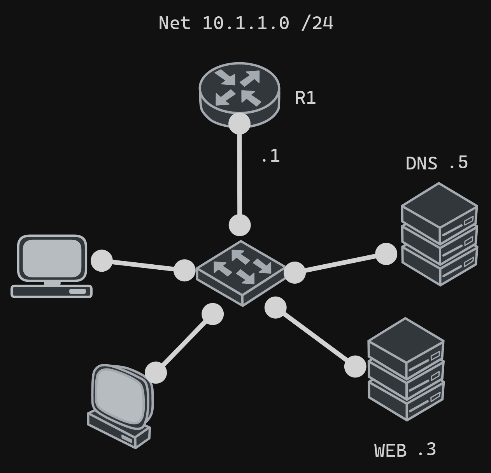
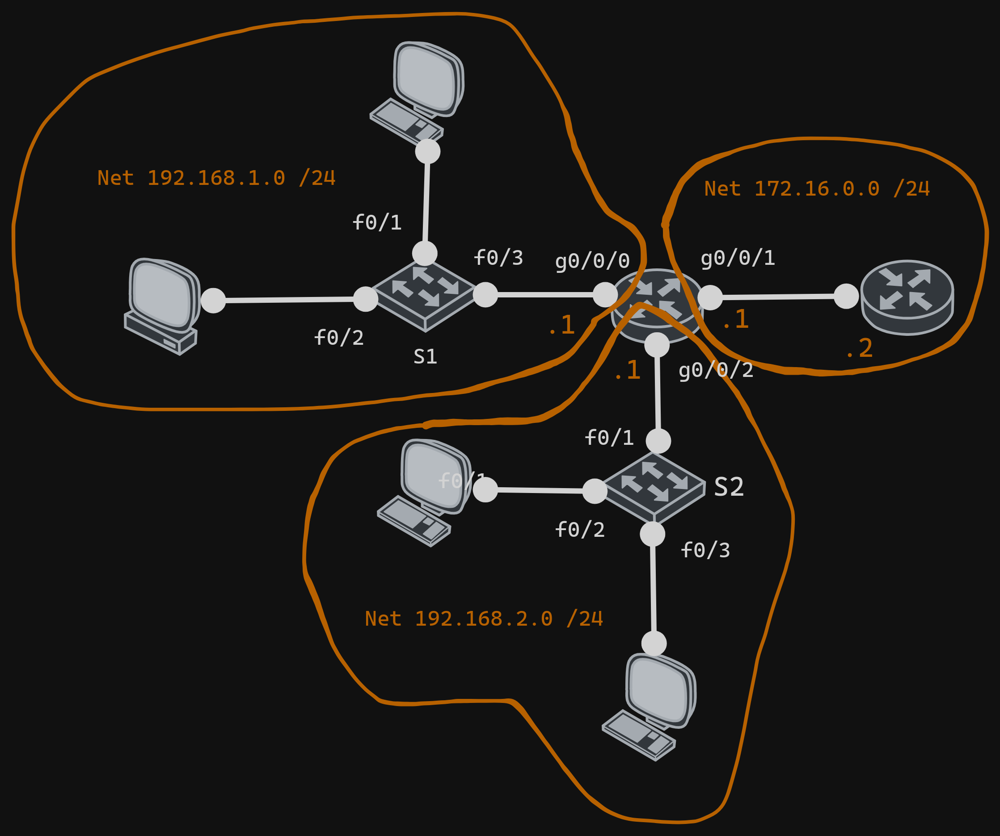

# DHCP V4

## Commands

### DHCPv4 excluded addresses

```bash
ip dhcp excluded-address [start-ip-address] [last-ip-address]
ip dhcp excluded-address [single-ip-address]
```

#### Show excluded addresses

```bash
show ip dhcp binding
show ip dhcp excluded-address
show running-config | include ip dhcp excluded-address
```

### DHCPv4 pool

```bash
ip dhcp pool [pool-name]
network [network-address] [subnet-mask]
default-router [default-gateway] ## gateway for the network
dns-server [dns-server]
domain-name [domain-name]
```

#### Show DHCPv4 pool

```bash
show ip dhcp pool
show running-config | include ip dhcp pool
```

### Helper address

```bash
interface [interface]
ip helper-address [dhcp-server-address]
```

#### Show helper address

```bash
show running-config | include ip helper-address
```

#### Notes

- `ip helper-address` is used to forward DHCP requests to a DHCP server on another network

### Router as DHCP server

```bash
interface [interface]
ip address dhcp
```

## Example 1



### R1

```bash
no ip domain-lookup
ip dhcp excluded-address 10.1.1.1 10.1.1.19
ip dhcp pool LAN1
network 10.1.1.0 255.255.255.0
default-router 10.1.1.1
dns-server 10.1.1.5
domain-name example.com
```

## Example 2 with helper address



### S1

```bash
inter range f0/1 - 5
switchport mode access
```

### S2

```bash
inter range f0/1 - 5
switchport mode access
```

### R1

```bash
no ip domain-lookup
ip dhcp excluded-address
inter g0/0
ip address 192.168.1.1 255.255.255.0
no shutdown
inter g0/1
ip address 172.16.0.1 255.255.255.0
no shutdown
inter g0/2
ip address 192.168.2.1 255.255.255.0
no shutdown
inter g0/0
ip helper-address 172.16.0.1
inter g0/1
ip helper-address 172.16.0.1
```

### R2

```bash
no ip domain-lookup
ip dhcp pool LANG0
network 192.168.1.0 255.255.255.0
default-router 192.168.1.1
ip dhcp pool LANG1
network 192.168.2.0 255.255.255.0
default-router 192.168.2.1
```
