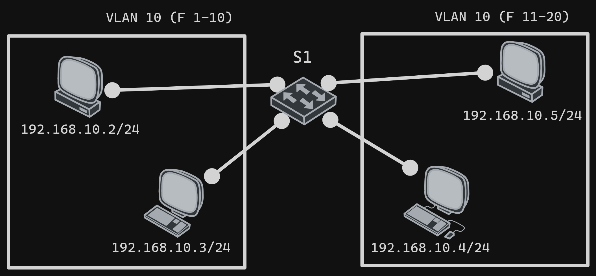
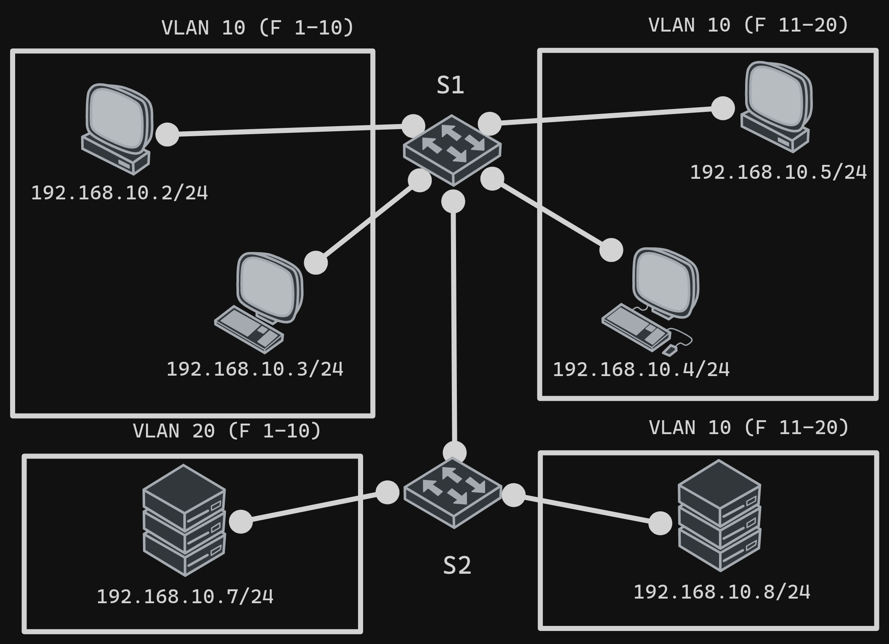

# VLAN Routing

## Vlan Commands

### Creation

For isolate ports in same switch

```bash
vlan [vlan-number]
name [name]
exit
```

### Assigning ports

```bash
interface [interface]
switchport mode access
switchport access vlan [vlan-number]
```

### Show vlans

```bash
show vlan
```

### Assigning ports range to vlan

For connect vlans in different switchs

```bash
interface range [inter-type] [interface] - [interface]
switchport mode trunk
switchport trunk allowed vlan [vlan-number]
```

### Trunk ports

```bash
interface [interface]
switchport mode trunk
switchport trunk allowed vlan [vlan-number]
```

#### Notes

- if you want to allow all vlans, not use the command switchport trunk allowed vlan
- On case allowed multiple vlans, use "," for delimiting the vlan numbers, example: `switchport trunk allowed vlan 10,20,30`

## Example basic 1



### Switch 1

```bash
vlan 10
name VLAN10
vlan 20
name VLAN20
inter f0/1-10
switchport mode access
switchport access vlan 10
shutdown
inter f0/11-20
switchport mode access
switchport access vlan 20
shutdown
```

## Example basic 2



### Switch 1

```bash
vlan 10
name VLAN10
vlan 20
name VLAN20
inter f0/1-10
switchport mode access
switchport access vlan 10
no shutdown
inter f0/11-20
switchport mode access
switchport access vlan 20
no shutdown
inter f0/24
switchport mode trunk
```

### Switch 2

```bash
vlan 10
name VLAN10
vlan 20
name VLAN20
inter f0/1-10
switchport mode access
switchport access vlan 10
no shutdown
inter f0/11-20
switchport mode access
switchport access vlan 20
no shutdown
inter f0/24
switchport mode trunk
```
