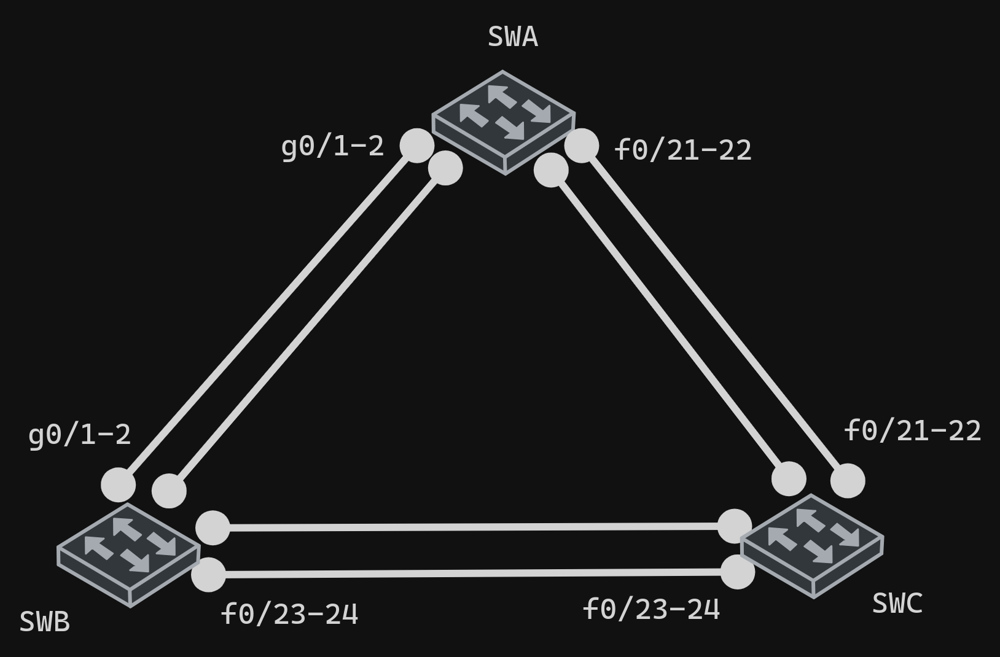

# Etherchannel

## Configuration

### LACP

|         | Active | Passive |
| ------- | ------ | ------- |
| Active  | yes    | yes     |
| Passive | yes    | no      |

### PAgP

|           | Desirable | auto |
| --------- | --------- | ---- |
| Desirable | yes       | yes  |
| auto      | yes       | no   |

### Static persistenace

|     | ON  |
| --- | --- |
| ON  | yes |

## Commands

### Create etherchannel

```bash
interface range fa0/1 - 2 ## Select interface for group
shutdown
## Assign group
channel-group [group-id] mode [active | passive | desirable | auto | on]
no shutdown
```

### Configure group

```bash
interface port-channel [group-id]
switchport mode trunk
switchport trunk allowed vlan [vlan-id]
```

#### Notes

- `switchport trunk allowed` is required only if you want to allow specific vlans, by default all vlans are allowed
- `switchport mode trunk` is required only if you want to use trunk mode (transport multiple vlans), by default it is access mode

### Show etherchannel

```bash
show etherchannel summary
show etherchannel port-channel
show etherchannel port-channel [group-id]
```

### Remove etherchannel

```bash
interface range fa0/1 - 2 ## Select interface for group
shutdown
no channel-group [group-id] mode [active | passive | desirable | auto | on]
no shutdown
```

## Example 1



### SWA

```bash
# Etherchannel group 1 #
interface range g0/1 - 2
shutdown
channel-group 1 mode desirable
no shutdown
interface port-channel 1
switchport mode trunk
# Etherchannel group 2 #
interface range f0/21-22
shutdown
channel-group 2 mode active
no shutdown
interface port-channel 2
switchport mode trunk
```

### SWB

```bash
# Etherchannel group 1 #
interface range g0/1 - 2
shutdown
channel-group 1 mode auto
no shutdown
interface port-channel 1
switchport mode trunk
# Etherchannel group 3 #
interface range f0/23-24
shutdown
channel-group 3 mode passive
no shutdown
interface port-channel 3
switchport mode trunk
```

### SWC

```bash
# Etherchannel group 2 #
interface range f0/21-22
shutdown
channel-group 2 mode active
no shutdown
interface port-channel 2
switchport mode trunk
# Etherchannel group 3 #
interface range f0/23-24
shutdown
channel-group 3 mode active
no shutdown
interface port-channel 3
switchport mode trunk
```
