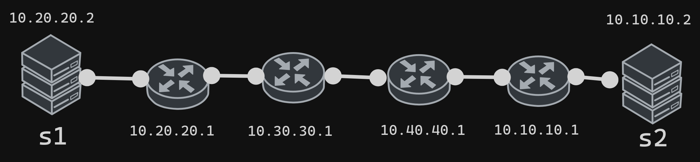
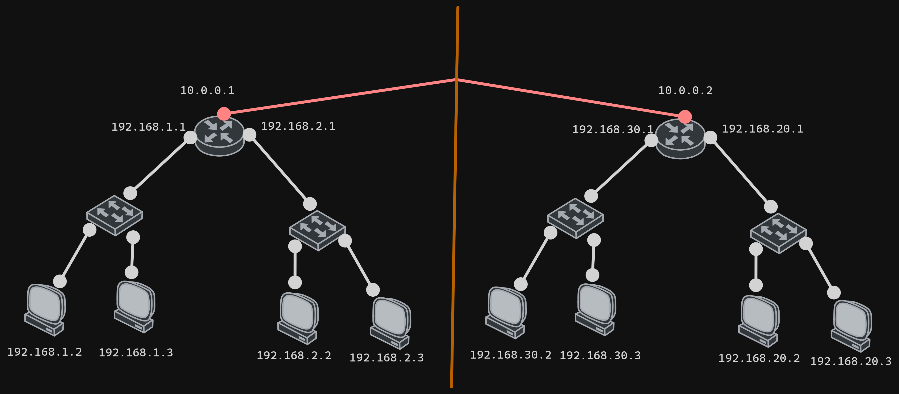
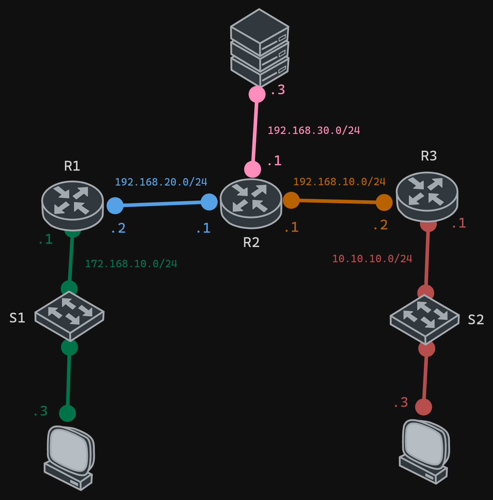

# Routing

## Ip route parameters

### Static routing

```bash
ip route [destiny-net-direction] [destiny-net-mask] [next-hop]
```

### Dynamic routing (RIP)

```cisco
router rip
version 2
no auto-summary
network [net direction] 
```

#### Notes

- The `no auto-summary` command is used to avoid the automatic summarization of the routes.
- The `network` command is used to indicate the networks that will be advertised.

## Example 1 static Routing



- Router with 10.20.20.1

```bash
ip route 10.10.10.0 255.255.255.0 10.30.30.1 
```

- Router with 10.30.30.1

```bash
ip route 10.10.10.0 255.255.255.0 10.40.40.1
ip route 10.20.20.0 255.255.255.0 10.20.20.1
```

- Router with 10.40.40.1

```bash
ip route 10.10.10.0 255.255.255.0 10.10.10.1 
ip route 10.20.20.0 255.255.255.0 10.30.30.1 
```

- Router with 10.10.10.1

```bash
ip route 10.20.20.0 255.255.255.0 10.40.40.1 
```

## Example 2 static Routing



### Router left

```bash
ip route 192.168.20.0 255.255.255.0 10.0.0.2
ip route 192.168.30.0 255.255.255.0 10.0.0.2
```

### Router right

```bash
ip route 192.168.1.0 255.255.255.0 10.0.0.1
ip route 192.168.2.0 255.255.255.0 10.0.0.1
```

## Example 3 dynamic Routing (RIP)



### Router 1

```bash
router rip
version 2
no auto-summary
network 172.168.10.0
network 192.168.20.0
```

### Router 2

```bash
router rip
version 2
no auto-summary
network 192.168.30.0
network 192.168.20.0
network 192.168.10.0
```

### Router 3

```bash
router rip
version 2
no auto-summary
network 192.168.10.0
network 10.10.10.0
```
