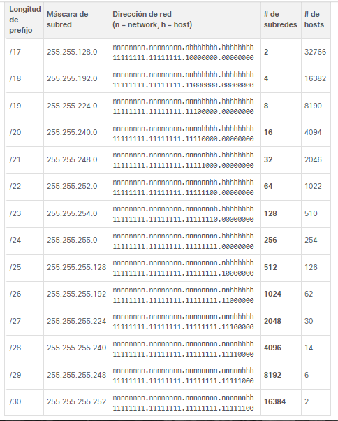

# Subnetting

## Subnetting table

| Decimal         | CIDR | addresses  | hosts      |
|-----------------|------|------------|------------|
| 0.0.0.0         | /0   | 4294967296 | 4294967294 |
| 128.0.0.0       | /1   | 2147483648 | 2147483646 |
| 192.0.0.0       | /2   | 1073741824 | 1073741822 |
| 224.0.0.0       | /3   | 536870912  | 536870910  |
| 240.0.0.0       | /4   | 268435456  | 268435454  |
| 248.0.0.0       | /5   | 134217728  | 134217726  |
| 252.0.0.0       | /6   | 67108864   | 67108862   |
| 254.0.0.0       | /7   | 33554432   | 33554430   |
| 255.0.0.0       | /8   | 16777216   | 16777214   |
| 255.128.0.0     | /9   | 8388608    | 8388606    |
| 255.192.0.0     | /10  | 4194304    | 4194302    |
| 255.224.0.0     | /11  | 2097152    | 2097150    |
| 255.240.0.0     | /12  | 1048576    | 1048574    |
| 255.248.0.0     | /13  | 524288     | 524286     |
| 255.252.0.0     | /14  | 262144     | 262142     |
| 255.254.0.0     | /15  | 131072     | 131070     |
| 255.255.0.0     | /16  | 65536      | 65534      |
| 255.255.128.0   | /17  | 32768      | 32766      |
| 255.255.192.0   | /18  | 16384      | 16382      |
| 255.255.224.0   | /19  | 8192       | 8190       |
| 255.255.240.0   | /20  | 4096       | 4094       |
| 255.255.248.0   | /21  | 2048       | 2046       |
| 255.255.252.0   | /22  | 1024       | 1022       |
| 255.255.254.0   | /23  | 512        | 510        |
| 255.255.255.0   | /24  | 256        | 254        |
| 255.255.255.128 | /25  | 128        | 126        |
| 255.255.255.192 | /26  | 64         | 62         |
| 255.255.255.224 | /27  | 32         | 30         |
| 255.255.255.240 | /28  | 16         | 14         |
| 255.255.255.248 | /29  | 8          | 6          |
| 255.255.255.252 | /30  | 4          | 2          |
| 255.255.255.254 | /31  | 2          | 0          |
| 255.255.255.255 | /32  | 1          | -          |

## Subnetting Image

## Subnetting Examples

### Example 1

4 networks

- Root Net:
192.168.123.0/24

192.168.123. 00000000

need 2 bits for 4 networks
2^2 = 4

- Subnets:

| Network   | Binary   | Dir                | Broadcast |
|-----------|----------|--------------------|-----------|
| 1         | 00       | 192.168.123.0/26   | .63       |
| 2         | 01       | 192.168.123.64/26  | .127      |
| 3         | 10       | 192.168.123.128/26 | .191      |
| 4         | 11       | 192.168.123.192/26 | .255      |
| --------- | -------- | ------------------ | --------  |

### Example 2

7 networks

- Root Net:
10.29.0.0/16

10.29. 00000000.00000000

need 3 bits for 8 networks
2^3 = 8

- Subnets:

| Network | Binary | Dir         | Broadcast     |
| ------- | ------ | ----------- | ------------- |
| 1       | 000    | 10.29.0.0   | 10.29.31.255  |
| 2       | 001    | 10.29.32.0  | 10.29.63.255  |
| 3       | 010    | 10.29.64.0  | 10.29.95.255  |
| 4       | 011    | 10.29.96.0  | 10.29.127.255 |
| 5       | 100    | 10.29.128.0 | 10.29.159.255 |
| 6       | 101    | 10.29.160.0 | 10.29.191.255 |
| 7       | 110    | 10.29.192.0 | 10.29.223.256 |
| 8       | 111    | 10.29.224.0 | 10.29.255.255 |

### Example 3

- Root Net:
192.168.0.0/24

192.168. 00000000 .00000000

- Subnets:
2 of 20 hosts
1 of 80 hosts
3 of 2 hosts

sort by hosts count:

- A - 80 hosts
- B - 20 hosts
- C - 20 hosts
- D - 2 hosts
- D - 2 hosts

### A - 80 hosts

2 ^ 7 = 128 - 2 = 126 hosts

Mask: /25 = 255.255.255.128 # get by table
Dir: 192.168.0.0
Broadcast: 192.168.0.127 #Dir + 2^7 - 1

### B - 20 hosts

Dir: 192.168.0.128 # (before dir) + 1

2 ^ 5 = 32 - 2 = 30 hosts

Mask: /27 = 255.255.255.224 # get by table
Broadcast: 192.168.0.159 #Dir + 2^5 - 1

### C - 20 hosts

Dir: 192.168.0.160 # (before dir) + 1

2 ^ 5 = 32 - 2 = 30 hosts

Mask: /27 = 255.255.255.224 # get by table
Broadcast: 192.168.0.191 #Dir + 2^5 - 1

### D - 2 hosts

Dir: 192.168.0.192 # (before dir) + 1

2 ^ 2 = 4 - 2 = 2 hosts

Mask: /30 = 255.255.255.252 # get by table
Broadcast: 192.168.0.195 #Dir + 2^2 - 1

### E - 2 hosts

Dir: 192. 168. 0. 196 # (before dir) + 1

2 ^ 2 = 4 - 2 = 2 hosts

Mask: /30 = 255. 255. 255. 252 # get by table
Broadcast: 192. 168. 0. 199 #Dir + 2^2 - 1

### F - 2 hosts

Dir: 192. 168. 0. 200 # (before dir) + 1

2 ^ 2 = 4 - 2 = 2 hosts

Mask: /30 = 255. 255. 255. 252 # get by table
Broadcast: 192. 168. 0. 203 #Dir + 2^2 - 1

### Subnets in table

| Network | hosts | Dir           | Broadcast     |
| ------- | ----- | ------------- | ------------- |
| A       | 80    | 192.168.0.0   | 192.168.0.127 |
| B       | 20    | 192.168.0.128 | 192.168.0.159 |
| C       | 20    | 192.168.0.160 | 192.168.0.191 |
| D       | 2     | 192.168.0.192 | 192.168.0.195 |
| E       | 2     | 192.168.0.196 | 192.168.0.199 |
| F       | 2     | 192.168.0.200 | 192.168.0.203 |
